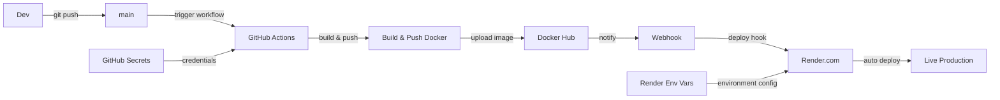

# Pets Gallery Frontend

### Descripción

**Pets Gallery Frontend** es un proyecto diseñado para implementar un flujo de **autodespliegue (autodeploy)** mediante **Integración Continua y Despliegue Continuo (CI/CD)**.

Cada vez que se realiza un **`git push` en la rama `main`**, se activa un **workflow en GitHub Actions**, el cual **construye una imagen Docker** de la aplicación y la **publica en DockerHub** utilizando un sistema de **etiquetado (tagging)** de versiones.

Posteriormente, mediante un **webhook**, **DockerHub notifica a Render** sobre la nueva imagen disponible.  
Render **descarga y despliega automáticamente** la última versión, asegurando así una **actualización continua y sin intervención manual** del proyecto.



### Prerrequisitos

 - [Node.js 22.20.0](https://nodejs.org/en/download) o superior
 - [pnpm](https://pnpm.io/installation) (recomendado) o npm
 - [Git](https://pnpm.io/installation)
 
### Instalación
1. **Clonar el repositorio**

```powershell
git clone https://github.com/KuajinaiSS/pets-gallery-frontend.git
cd pets-gallery-frontend
```

2. **Instalar dependencias con pnpm**
```powershell
pnpm install
```

3. **Ejecutar proyecto**
```powershell
pnpm dev
```
el proyecto se levantara en http://localhost:3000

##### TODO:

 - [ ] Integrarlo con un backend con un flujo similar.
 - [ ] revisar posibilidad de inicio de sesión.

